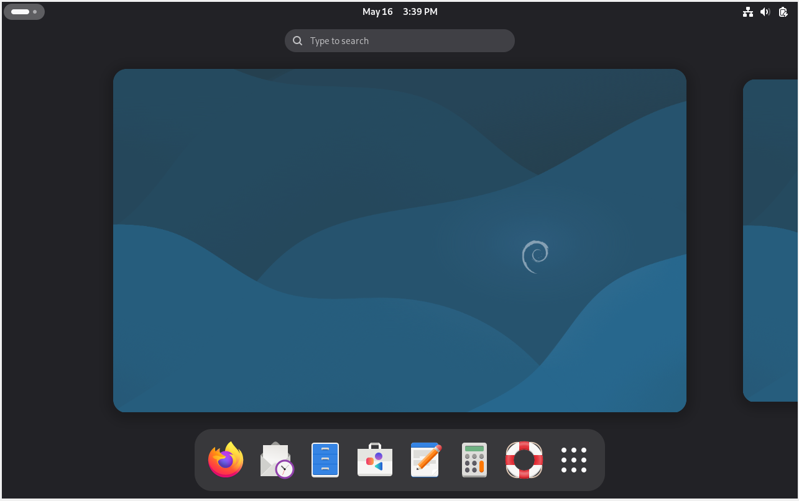

# raspberry-pi-project

# VM Setup
Go to VirtualBox and click on create a new VM.  
Name: NAV-OMV   
Linux OS    
Debian 64 bit   
Memory: 4096 MB 
VDI Size: 50 GB 
Then click on create, then go to the storage section and create a new VDI with around 100 GB of storage.    
Then go to the command line and type wget https://cdimage.debian.org/debian-cd/current/amd64/iso-cd/debian-13.4.0-amd64-netinst.iso to download Debian iso. 
Then go the storage for the VM and put the Debian iso into it.  
Then boot up the VM and choose the install option and go through the usual steps with hostname config, root password, language/location.    
For partitioning select the guided option with the 50 GB assigned, all files in one partition, then confirm and write to disk.  
For package manager set extra media to No, for debian achive mirror country choose either the US or closest one with the mirror set to deb.debian.org and leave HTTP proxy blank.   
Then you can uncheck GNOME and the Desktop environment if you want make sure to check SSH Server and standard system utilties or install later when up. Then wait a little bit or so, then afterwards install GRUB to /dev/sda and then wait a while for the setup to continue. When done you will be able to login like so and the lander: 
  
